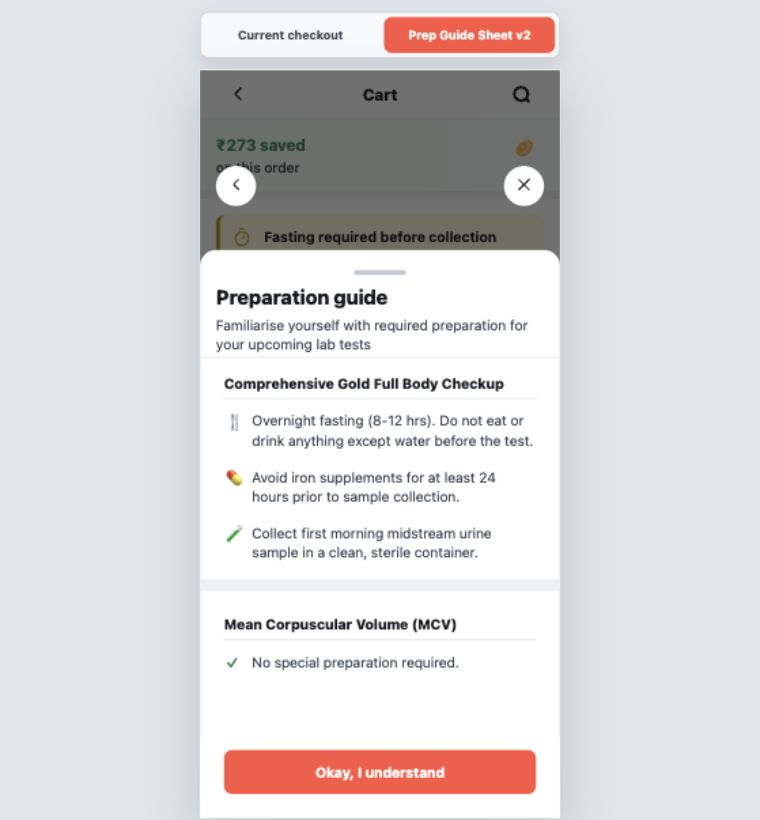

# DesMania

DesMania is a documented, high-fidelity React prototype for the Diagnostics Ideal Checkout flow. It was built for a fixed 360px mobile canvas and preserves both the final coded experience and the design-system reasoning that led to it.

This repository is not only a runnable prototype. It is also a record of how the checkout screens were deconstructed, specified, audited, implemented, iterated, and verified.

## 1. What This System Is

DesMania has two connected systems working together:

1. **Design-system knowledge system**
   - Converts Figma/UI decisions into reusable specs.
   - Stores token references, component behavior, accessibility rules, and implementation constraints.
   - Keeps a cache of design decisions and token audit results so future work can build on prior work.

2. **Runnable checkout prototype**
   - Implements the Diagnostics Checkout happy path in Vite, React, TypeScript, and CSS Modules.
   - Uses a fixed 360px mobile shell for fidelity with the original mobile designs.
   - Provides both the current checkout flow and an alternate preparation guide preview.

The system works because design decisions are captured before and alongside implementation. Specs and cache files explain what should be built; React components show how those decisions were translated into a working prototype.

## 2. Core Repository Layers

```text
tokens/                Design token source of truth and token hierarchy notes
specs/                 Component and checkout screen specifications
cache/                 Token audits, build decisions, and prior component memory
flows/                 End-to-end Diagnostics Checkout flow model
skills/                Reusable workflow instructions for Figma-to-spec work
components/            Shared primitives such as Button, Badge, and Icon
src/checkout/          Checkout app, local state machine, screens, and sheets
src/assets/checkout/   Local checkout assets and Figma-extracted illustrations
docs/                  Handoff documentation and QA outputs
```

Each layer has a different job. Tokens define the available design language. Specs describe the component or screen. Cache files explain what was found and audited. The React app implements the flow. Docs summarize how everything works and what changed.

## 3. Skills Used In This Project

The `skills/` directory documents the repeatable workflow used to move from design inspection to implementation-ready documentation.

### `ds-team`

`skills/ds-team.md` is the orchestrator.

It helps by coordinating the full design-system workflow:

- Loads existing cache files so new work inherits prior decisions.
- Reads token references from `tokens/tokens.json`.
- Delegates Figma interpretation to `component-god`.
- Delegates token validation to `token-police`.
- Produces cache files that preserve the audit trail.

This is useful because a checkout flow has many related components. Without orchestration, every component can drift in naming, spacing, token usage, and interaction rules. `ds-team` keeps the work coherent.

### `component-god`

`skills/component-god.md` is the spec writer.

It helps by translating a Figma frame into a complete component spec:

- Component name and prompt aliases.
- Variant dimensions.
- HTML semantics.
- Sub-elements and slots.
- Auto-layout spacing and padding.
- Interactive states.
- Accessibility expectations.
- Token references for colors, type, space, radius, and shadows.

It intentionally does not write code. That separation matters: first the design is converted into a stable specification, then the implementation follows that specification.

### `token-police`

`skills/token-police.md` is the deterministic token auditor.

It helps by checking that the spec is actually compatible with the token system:

- Verifies every `token.*` reference exists in `tokens/tokens.json`.
- Flags literal hex values in specs.
- Checks required focus and disabled state fields.
- Reports missing tokens instead of inventing substitutes.

This prevents hidden design-system drift. If a color or spacing value has no semantic token, the gap is documented instead of silently hard-coded.

## 4. Step-By-Step Work We Followed

### Step 1: Deconstructed the Diagnostics Checkout flow

The checkout journey was mapped into `flows/DiagnosticsCheckout.md`.

The happy path is:

```text
Cart
  -> Select Patient sheet
  -> Add Patient sheet, optional
  -> Select Slot sheet
  -> Choose Address page, optional
  -> Booking Details sheet
```

Payment and Booking Summary were kept out of scope because those screens were not deconstructed for this milestone.

### Step 2: Captured component specs and cache notes

Reusable components and checkout-specific pieces were documented under `specs/` and `cache/`.

Examples include:

- `AppHeader`
- `SavingsBanner`
- `LabTestCard`
- `PreparationAlertBanner`
- `AdditionalServicesRow`
- `BillSummaryCard`
- `StickyBottomBar`
- `BottomSheet`
- `AccordionCard`
- `SummaryRow`
- `TimeSlotRow`

The cache layer records token audits, missing token notes, measured values, and decisions made during deconstruction.

### Step 3: Built the React prototype

The runnable app was implemented in `src/checkout/CheckoutApp.tsx` and styled in `src/checkout/CheckoutApp.module.css`.

The app uses local React state instead of a backend:

- `previewMode`: switches between current checkout and Prep Guide Sheet v2.
- `page`: switches between Cart and Choose Address.
- `sheet`: controls active bottom sheets.
- Local IDs track selected patient, address, slot, day, additional services, and bill summary expansion.

This is enough for a high-fidelity prototype because the goal is UX fidelity and flow validation, not production persistence.

### Step 4: Implemented the 360px mobile shell

The prototype is fixed to a 360px-wide mobile app shell.

This lets the coded screens match the mobile design assumptions:

- Sticky app headers.
- Sticky bottom bars.
- Bottom sheets anchored to the mobile shell.
- Full-screen Choose Address route.
- No tablet or desktop responsive variants in this milestone.

The preview toggle is outside the mobile shell so it does not alter the screen being evaluated.

### Step 5: Added local checkout assets

Checkout assets were stored under `src/assets/checkout/` and exported through `src/assets/checkout/index.ts`.

This includes:

- TATA 1mg Labs logo.
- Lab test illustration.
- Savings coin.
- Coupon and NeuCoins artwork.
- Additional services illustrations.
- Summary row icons.
- Weather icons.
- Patient avatars.

Complex illustrations remain local assets. Only reusable UI symbols belong in the design-system `Icon` component.

### Step 6: Implemented the current checkout screens

The current checkout prototype includes:

- Cart screen with savings, test cards, preparation alert, coupon, NeuCoins, additional services, bill summary, and sticky CTA.
- Select Patient bottom sheet.
- Add Patient stacked bottom sheet.
- Select Slot bottom sheet.
- Choose Address full-screen page.
- Booking Details bottom sheet.
- Expandable bill summary.

### Step 7: Iterated on preparation guide UX

Preparation guidance had multiple treatments:

1. **Earlier referenced concept**
   - A tappable row opened a consolidated preparation bottom sheet with tabs.
   - The repo references this as a previous design, but no full standalone implementation spec existed locally.

2. **Current inline preparation UX**
   - Cart-level `PreparationAlertBanner`.
   - Inline expanded preparation details inside each `LabTestCard`.
   - No chevron and no interaction required to see prep details.

3. **Prep Guide Sheet v2 preview**
   - Added as a separate preview mode.
   - Does not replace the current checkout.
   - Shows a dimmed cart background and a preparation guide bottom sheet.
   - Uses the shared documented `Button` component for the bottom CTA.

### Step 8: Corrected UI details from QA feedback

Two notable QA corrections were made:

- Additional Services rows were reset from browser-default grey button styling into proper selectable white cards.
- Prep Guide Sheet v2 CTA was corrected from an oversized custom 68px button to the documented 44px shared Button primitive.

### Step 9: Verified the output

Validation included:

- `npm run build`.
- Browser checks at `http://127.0.0.1:5173/`.
- 360px app width checks.
- No-horizontal-overflow checks.
- Happy-path interaction checks through Booking Details.
- Prep Guide Sheet v2 preview checks.
- CTA measurement check: 44px height and 312px width.

QA results are documented in [docs/qa-results.md](docs/qa-results.md).

## 5. How The Prototype Works Internally

`CheckoutApp` is the root state machine.

It renders:

- The external preview switcher.
- The fixed 360px app shell.
- The current page: Cart or Choose Address.
- The active checkout sheet, if any.
- The Prep Guide Sheet v2 overlay when preview mode is active.

The flow is intentionally local and deterministic. There is no router, server API, or persistent database. This keeps the prototype focused on interaction quality, visual fidelity, and checkout state transitions.

## 6. Preview Modes And Outputs

The app has two preview modes:

- `Current checkout`: the primary cart-to-booking happy path.
- `Prep Guide Sheet v2`: alternate preparation guide bottom-sheet preview.

The key visible output committed in this repo is:



This screenshot documents the corrected v2 prep sheet with a DS-compliant 44px CTA.

## 7. What Is Included

- Runnable React/Vite prototype.
- Local checkout assets.
- Design-system primitives.
- Token source files.
- Component specs.
- Cache and token audit notes.
- Flow documentation.
- Detailed implementation and QA documentation.
- GitHub publication-ready repository structure.

## 8. What Is Not Included

- Payment page implementation.
- Booking Summary implementation.
- Backend/API integration.
- Responsive tablet/desktop layouts.
- Persistent user/session storage.

These are intentionally excluded because the milestone focused on the high-fidelity 360px diagnostics checkout happy path.

## 9. Documentation Map

- [Checkout Flow](docs/checkout-flow.md)
- [Implementation Notes](docs/implementation-notes.md)
- [Preparation Guide Iterations](docs/preparation-guide-iterations.md)
- [QA Results](docs/qa-results.md)

## 10. Useful Commands

The README intentionally starts with fundamentals rather than setup, but the project can still be run locally with:

```bash
npm install
npm run dev
```

Production validation:

```bash
npm run build
```

## 11. GitHub Publication

This project was prepared and pushed as the public GitHub repository:

```text
https://github.com/yashsharma1mg/DesMania
```

Generated dependencies and build output are intentionally excluded from Git. Source assets, specs, cache documentation, flow docs, implementation docs, and selected QA screenshots are committed.
