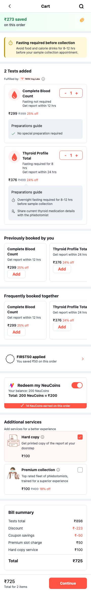

# QA Results

## Build Validation

Command:

```bash
npm run build
```

Result:

```text
tsc && vite build completed successfully
```

The latest production build transformed 57 modules and emitted the Vite bundle successfully.

## Browser Validation

The prototype was checked in the browser at `http://127.0.0.1:5173/`.

Validated behaviors:

- The app shell measures 360px wide.
- The external preview toggle is outside the app shell.
- `Current checkout` is the default mode.
- `Prep Guide Sheet v2` opens the preparation guide dialog over the cart.
- Switching back to `Current checkout` closes the v2 dialog.
- No horizontal overflow was detected.
- The current checkout entry point still exposes one `Continue` CTA.

## Current Checkout Page QC

The full generated Current Checkout page was captured as a single 360px-wide artifact by expanding the internal app shell to the page scroll height.

Measured browser result:

```text
appWidth: 360px
appHeight: 2311px
pageScrollHeight: 2311px
horizontalOverflow: false
```

Validated page sections:

- App header with Cart title and search action.
- Savings banner.
- Cart-level preparation alert.
- Tests added section with inline preparation details.
- Previously booked carousel.
- Frequently booked together carousel.
- Coupon widget.
- NeuCoins widget.
- Additional services section.
- Bill summary.
- Sticky Continue CTA.

Changes represented in this generated page:

- Added `PreparationAlertBanner` above the Tests added section.
- Replaced placeholder preparation messaging with inline per-test preparation rows.
- Preserved no-preparation state with a success checkmark row.
- Added local Figma/checkout assets for lab, savings, coupon, NeuCoins, VAS, summary, weather, and avatar artwork.
- Corrected Additional Services rows from browser-default grey button styling to DS-aligned selectable cards.
- Preserved 360px shell behavior with no page-level horizontal overflow.



## Checkout Happy Path

Validated flow:

```text
Cart
  -> Continue
  -> Select Patient
  -> Add Patient
  -> Save
  -> Select Patient
  -> Proceed to slot selection
  -> Select Slot
  -> Confirm slot
  -> Booking Details
```

## Prep Guide Sheet v2 CTA

The bottom CTA was corrected from a custom oversized treatment to the shared Button primitive.

Measured browser result:

```text
buttonHeight: 44px
buttonWidth: 312px
appWidth: 360px
horizontalOverflow: false
```

## Prep Guide Sheet v2 Output


